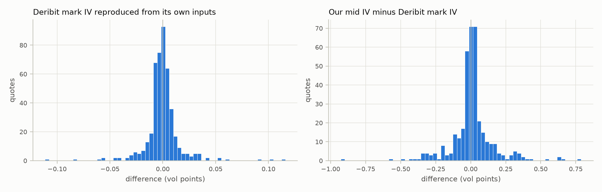
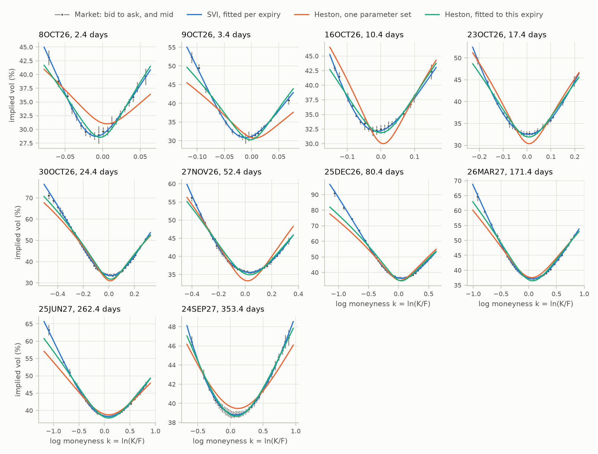
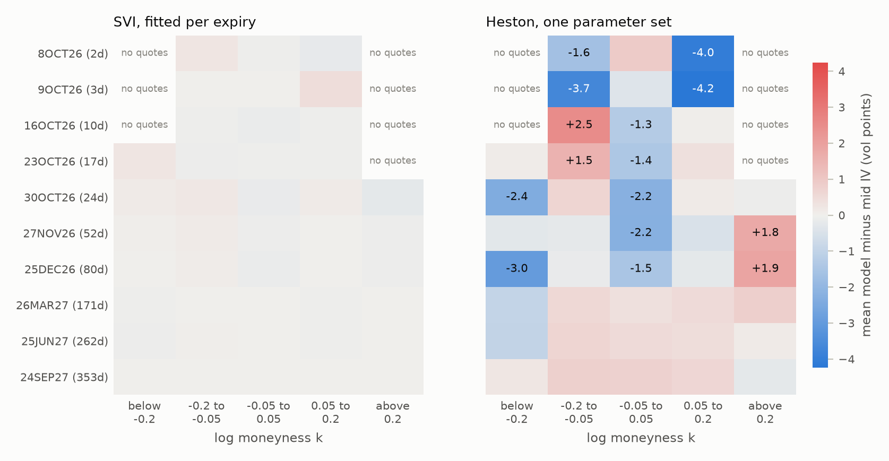
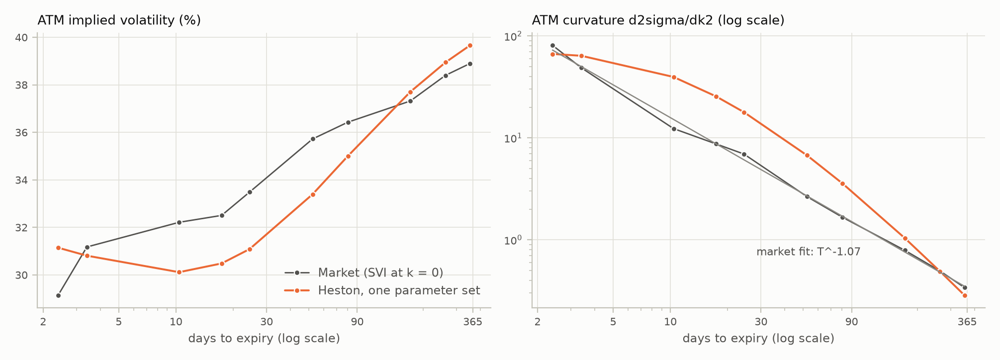
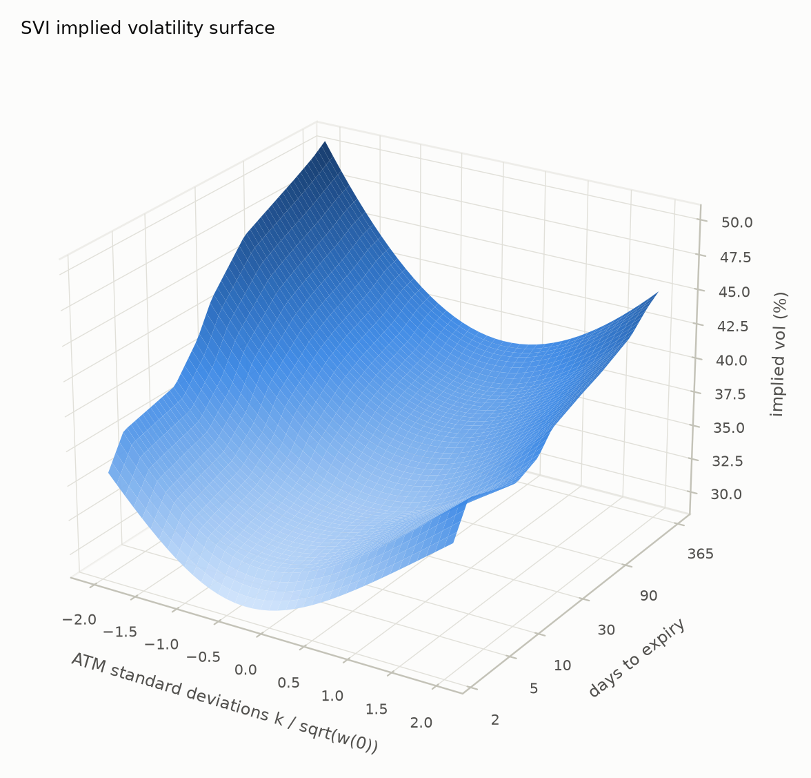

# BTC implied volatility report

Snapshot taken 2026-10-05T22:27:05.007393Z (quotes computed by Deribit at 2026-10-05T22:27:04.849000+00:00), `data/sample/BTC/20261005T222705Z`. Generated by ivcrypto 0.1.0, commit `2e23b8d9dc5a82547b434538766df4ea85adef5a`. All IVs and errors are in percent and vol points; k = ln(K/F).

## Cleaning

| Step | Removed | Remaining |
|---|---|---|
| options in snapshot | 0 | 946 |
| unmatched | 0 | 946 |
| expiry_too_close | 120 | 826 |
| no_bid | 17 | 809 |
| no_ask | 0 | 809 |
| crossed | 0 | 809 |
| wide_spread | 23 | 786 |
| in_the_money | 413 | 373 |
| no_implied_vol | 0 | 373 |

| Expiry | Days | Forward | Source | Pairs | Scatter (bps) | Std error (bps) | Minus future (bps) | Coin discount |
|---|---|---|---|---|---|---|---|---|
| 6OCT26 | 0.4 | 85,921.0 | parity | 7 | 0.52 | 0.34 | +1.17 | 0.9998 |
| 7OCT26 | 1.4 | 85,931.0 | parity | 8 | 0.63 | 0.30 | +0.50 | 1.0002 |
| 8OCT26 | 2.4 | 85,943.0 | parity | 8 | 0.85 | 0.36 | +0.29 | 1.0006 |
| 9OCT26 | 3.4 | 85,954.0 | parity | 8 | 2.14 | 0.83 | -0.08 | 1.0002 |
| 16OCT26 | 10.4 | 86,063.2 | parity | 8 | 2.13 | 0.84 | +0.52 | 0.9997 |
| 23OCT26 | 17.4 | 86,158.3 | parity | 8 | 2.30 | 0.89 | +0.09 | 1.0001 |
| 30OCT26 | 24.4 | 86,291.4 | parity | 8 | 1.90 | 0.77 | +2.54 | 0.9995 |
| 27NOV26 | 52.4 | 86,640.1 | parity | 8 | 2.41 | 0.87 | +3.22 | 0.9997 |
| 25DEC26 | 80.4 | 86,982.2 | parity | 8 | 2.83 | 1.05 | +2.90 | 1.0000 |
| 26MAR27 | 171.4 | 88,095.4 | parity | 8 | 1.33 | 0.51 | +2.77 | 0.9999 |
| 25JUN27 | 262.4 | 89,271.2 | parity | 8 | 1.15 | 0.41 | -0.30 | 0.9998 |
| 24SEP27 | 353.4 | 90,448.5 | parity | 8 | 1.04 | 0.37 | +1.56 | 1.0006 |

## Implied volatility against Deribit

<picture>
  <source media="(prefers-color-scheme: dark)" srcset="figures/iv_validation_dark.png">
  
</picture>

| Comparison | Group | n | Median | 5th pct | 95th pct | Max abs | Within rounding |
|---|---|---|---|---|---|---|---|
| mark IV reproduction, resolvable marks | all | 458 | -0.0008 | -0.0229 | +0.0221 | 0.1161 | 54.4% |
| mark IV reproduction, unresolvable marks | all | 6 | -0.0307 | -0.1657 | +0.0140 | 0.2034 |  |
| ticker IV reproduction, OTM quotes | ask | 473 | -0.0000 | -0.0045 | +0.0101 | 0.0519 | 91.3% |
| ticker IV reproduction, OTM quotes | bid | 422 | -0.0007 | -0.0047 | +0.0047 | 0.6607 | 97.9% |
| ticker IV reproduction, ITM quotes | ask | 473 | +0.0005 | -0.0046 | +0.0179 | 4.6482 | 89.4% |
| ticker IV reproduction, ITM quotes | bid | 312 | -0.0006 | -0.0048 | +0.0045 | 5.0471 | 98.1% |
| our mid IV minus Deribit mark IV | all | 373 | +0.0090 | -0.2605 | +0.2925 | 0.9276 |  |

## Smiles

<picture>
  <source media="(prefers-color-scheme: dark)" srcset="figures/smiles_dark.png">
  
</picture>

| Expiry | Days | Quotes | ATM vol | rho | SVI RMSE | SVI max error | SVI inside band | Starts agreeing | Binding bounds |
|---|---|---|---|---|---|---|---|---|---|
| 8OCT26 | 2.4 | 20 | 29.14% | -0.234 | 0.266 | 0.553 | 100% | 9 |  |
| 9OCT26 | 3.4 | 19 | 31.18% | -0.314 | 0.340 | 1.027 | 95% | 9 |  |
| 16OCT26 | 10.4 | 19 | 32.22% | -0.391 | 0.227 | 0.506 | 100% | 9 |  |
| 23OCT26 | 17.4 | 23 | 32.51% | -0.342 | 0.155 | 0.299 | 100% | 9 |  |
| 30OCT26 | 24.4 | 49 | 33.48% | -0.085 | 0.369 | 1.732 | 94% | 9 |  |
| 27NOV26 | 52.4 | 48 | 35.72% | -0.366 | 0.173 | 0.624 | 98% | 9 |  |
| 25DEC26 | 80.4 | 48 | 36.43% | -0.292 | 0.278 | 1.021 | 96% | 9 |  |
| 26MAR27 | 171.4 | 52 | 37.32% | -0.252 | 0.165 | 0.597 | 100% | 9 |  |
| 25JUN27 | 262.4 | 54 | 38.40% | -0.250 | 0.114 | 0.449 | 100% | 9 |  |
| 24SEP27 | 353.4 | 41 | 38.90% | -0.582 | 0.072 | 0.336 | 100% | 9 | left wing at Lee bound |

SSVI (one surface, arbitrage free by construction): rho = -0.107, eta = 0.979, gamma = 0.500.

| Expiry | Days | theta | SSVI RMSE | SSVI inside band |
|---|---|---|---|---|
| 8OCT26 | 2.4 | 0.00053 | 2.343 | 10% |
| 9OCT26 | 3.4 | 0.00088 | 2.116 | 16% |
| 16OCT26 | 10.4 | 0.00261 | 1.794 | 16% |
| 23OCT26 | 17.4 | 0.00471 | 1.147 | 22% |
| 30OCT26 | 24.4 | 0.00759 | 2.737 | 37% |
| 27NOV26 | 52.4 | 0.01793 | 0.921 | 40% |
| 25DEC26 | 80.4 | 0.02868 | 4.159 | 31% |
| 26MAR27 | 171.4 | 0.06421 | 1.163 | 37% |
| 25JUN27 | 262.4 | 0.10401 | 0.815 | 43% |
| 24SEP27 | 353.4 | 0.14436 | 0.445 | 46% |

## Static arbitrage

Per expiry SVI fits and raw quotes:

| Check | Prices | Tests | Violations | Inside quoted range |
|---|---|---|---|---|
| butterfly | model | 10 | 1 | 0 |
| calendar | model | 9 | 3 | 0 |
| call monotonicity | mid | 440 | 0 | 0 |
| call monotonicity | executable | 9531 | 0 | 0 |
| call convexity | mid | 428 | 42 | 42 |
| call convexity | executable | 144770 | 0 | 0 |
| put monotonicity | mid | 429 | 0 | 0 |
| put monotonicity | executable | 9248 | 0 | 0 |
| put convexity | mid | 417 | 42 | 42 |
| put convexity | executable | 141015 | 0 | 0 |
| calendar | mid, interpolated | 325 | 0 | 0 |

SSVI, at the expiries and at maturities in between:

| Check | Tests | Violations |
|---|---|---|
| butterfly | 130 | 0 |
| calendar | 129 | 0 |

## Heston

One parameter set: v0 = 0.1048, kappa = 15.319, theta = 0.1846, xi = 4.963, rho = -0.106; Feller ratio 2 kappa theta / xi^2 = 0.230 (violated).

<picture>
  <source media="(prefers-color-scheme: dark)" srcset="figures/residual_heatmaps_dark.png">
  
</picture>

| Quotes | n | SVI RMSE | SSVI RMSE | Heston RMSE | Heston per expiry RMSE | SVI inside band | Heston inside band |
|---|---|---|---|---|---|---|---|
| all | 373 | 0.23 | 2.10 | 2.01 | 1.26 | 98% | 20% |
| under 7 days | 39 | 0.30 | 2.24 | 2.74 | 1.23 | 97% | 18% |
| 7 to 30 days | 91 | 0.30 | 2.24 | 1.86 | 1.13 | 97% | 21% |
| 30 to 90 days | 96 | 0.23 | 3.01 | 2.65 | 1.89 | 97% | 24% |
| over 90 days | 147 | 0.13 | 0.88 | 1.23 | 0.70 | 100% | 18% |
| k -0.2 to -0.05 | 69 | 0.26 | 1.08 | 1.72 | 1.16 | 96% | 22% |
| k -0.05 to 0.05 | 85 | 0.16 | 1.54 | 1.85 | 0.82 | 100% | 8% |
| k 0.05 to 0.2 | 72 | 0.14 | 0.85 | 1.03 | 0.67 | 100% | 18% |
| k below -0.2 | 82 | 0.33 | 3.92 | 3.21 | 2.20 | 98% | 30% |
| k above 0.2 | 65 | 0.18 | 0.84 | 1.14 | 0.44 | 97% | 23% |

<picture>
  <source media="(prefers-color-scheme: dark)" srcset="figures/atm_term_structure_dark.png">
  
</picture>

| Expiry | Days | Market ATM vol | Heston ATM vol | Market skew | Heston skew | Market curvature | Heston curvature |
|---|---|---|---|---|---|---|---|
| 8OCT26 | 2.4 | 29.14% | 31.15% | +0.839 | -0.401 | 80.866 | 66.514 |
| 9OCT26 | 3.4 | 31.18% | 30.81% | +0.618 | -0.384 | 48.697 | 63.856 |
| 16OCT26 | 10.4 | 32.22% | 30.12% | +0.153 | -0.289 | 12.322 | 39.563 |
| 23OCT26 | 17.4 | 32.51% | 30.48% | -0.046 | -0.233 | 8.722 | 25.522 |
| 30OCT26 | 24.4 | 33.48% | 31.09% | -0.106 | -0.198 | 6.937 | 17.866 |
| 27NOV26 | 52.4 | 35.72% | 33.39% | -0.084 | -0.130 | 2.651 | 6.736 |
| 25DEC26 | 80.4 | 36.43% | 35.00% | -0.076 | -0.100 | 1.665 | 3.581 |
| 26MAR27 | 171.4 | 37.32% | 37.71% | -0.055 | -0.059 | 0.788 | 1.039 |
| 25JUN27 | 262.4 | 38.40% | 38.95% | -0.036 | -0.042 | 0.495 | 0.491 |
| 24SEP27 | 353.4 | 38.90% | 39.66% | -0.027 | -0.033 | 0.340 | 0.286 |

Power law fits of ATM curvature c T^-alpha: market alpha = 1.07, Heston alpha = 1.12.

Heston fitted to each expiry separately:

| Expiry | Days | v0 | kappa | theta | xi | rho | Feller ratio | RMSE | Inside band |
|---|---|---|---|---|---|---|---|---|---|
| 8OCT26 | 2.4 | 0.015 | 7.1 | 3.886 | 10.00 | +0.10 | 0.55 | 0.855 | 70% |
| 9OCT26 | 3.4 | 0.021 | 11.7 | 1.910 | 10.00 | +0.05 | 0.45 | 1.534 | 42% |
| 16OCT26 | 10.4 | 0.017 | 50.0 | 0.238 | 6.06 | +0.00 | 0.65 | 0.669 | 63% |
| 23OCT26 | 17.4 | 0.055 | 50.0 | 0.172 | 6.91 | -0.07 | 0.36 | 0.744 | 48% |
| 30OCT26 | 24.4 | 0.115 | 50.0 | 0.151 | 9.33 | -0.13 | 0.17 | 1.391 | 20% |
| 27NOV26 | 52.4 | 0.481 | 50.0 | 0.103 | 9.02 | -0.14 | 0.13 | 0.806 | 38% |
| 25DEC26 | 80.4 | 0.534 | 36.1 | 0.114 | 10.00 | -0.18 | 0.08 | 2.549 | 12% |
| 26MAR27 | 171.4 | 0.236 | 24.5 | 0.168 | 8.63 | -0.15 | 0.11 | 0.887 | 27% |
| 25JUN27 | 262.4 | 0.271 | 16.2 | 0.173 | 6.58 | -0.13 | 0.13 | 0.740 | 48% |
| 24SEP27 | 353.4 | 0.128 | 9.7 | 0.187 | 4.10 | -0.10 | 0.22 | 0.173 | 100% |

## Surface

<picture>
  <source media="(prefers-color-scheme: dark)" srcset="figures/surface_dark.png">
  
</picture>

