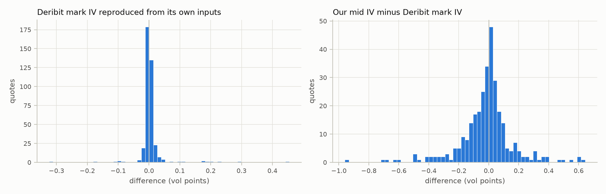
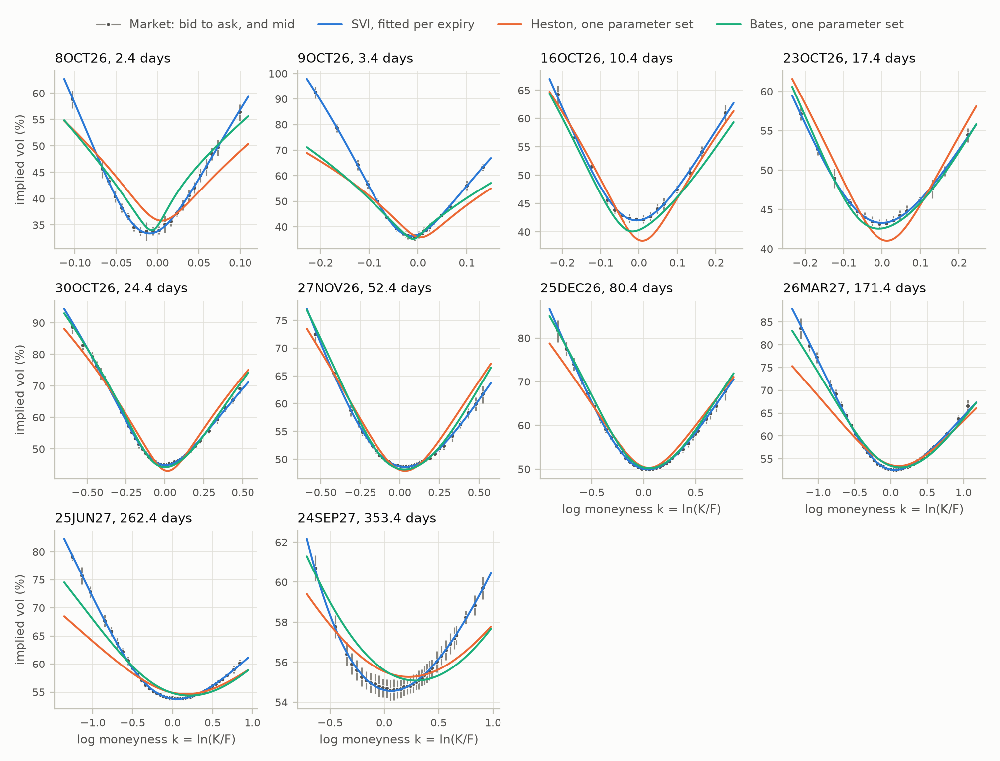
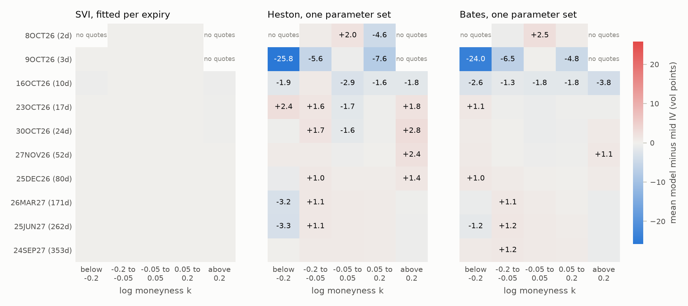
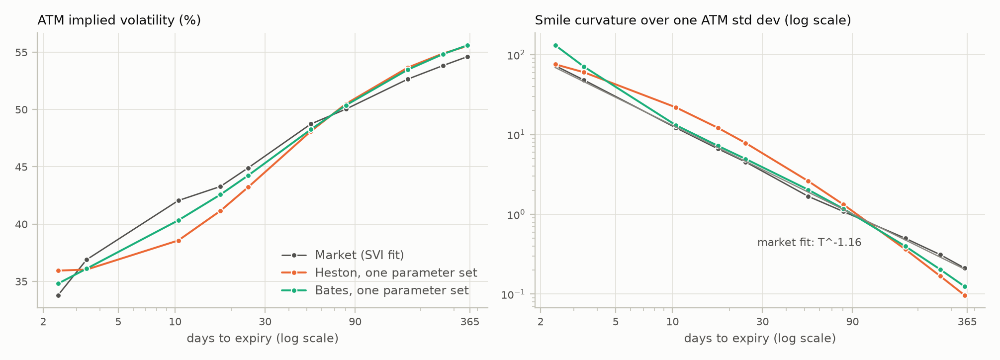
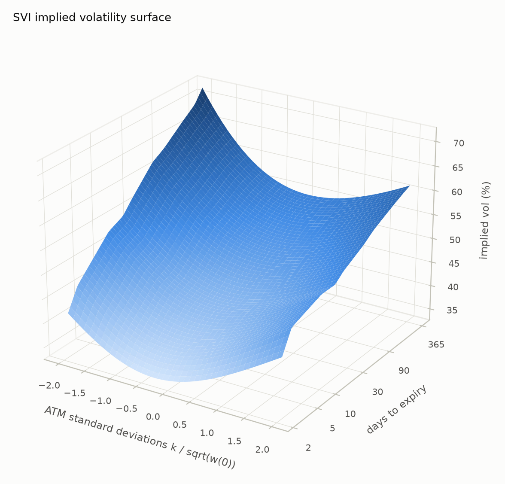

# ETH implied volatility report

Snapshot taken 2026-10-05T22:31:17.012780Z (quotes computed by Deribit at 2026-10-05T22:31:16.943000+00:00), `data/sample/ETH/20261005T223117Z`. Generated by ivcrypto 0.1.0, commit `4931b33997c1b316500743d7d4af074babb7299b`. All IVs and errors are in percent and vol points; k = ln(K/F).

## Cleaning

| Step | Removed | Remaining |
|---|---|---|
| options in snapshot | 0 | 790 |
| unmatched | 0 | 790 |
| expiry_too_close | 128 | 662 |
| no_bid | 7 | 655 |
| no_ask | 0 | 655 |
| crossed | 0 | 655 |
| wide_spread | 17 | 638 |
| in_the_money | 331 | 307 |
| no_implied_vol | 0 | 307 |

| Expiry | Days | Forward | Source | Pairs | Scatter (bps) | Std error (bps) | Minus future (bps) | Coin discount |
|---|---|---|---|---|---|---|---|---|
| 6OCT26 | 0.4 | 2,715.8 | parity | 8 | 1.78 | 1.13 | +1.92 | 0.9912 |
| 7OCT26 | 1.4 | 2,715.9 | parity | 8 | 3.09 | 1.67 | +0.95 | 0.9993 |
| 8OCT26 | 2.4 | 2,715.8 | parity | 8 | 3.00 | 1.39 | +0.18 | 1.0000 |
| 9OCT26 | 3.4 | 2,716.1 | parity | 8 | 1.83 | 0.70 | +0.88 | 1.0013 |
| 16OCT26 | 10.4 | 2,717.4 | parity | 7 | 2.79 | 1.35 | -0.05 | 1.0017 |
| 23OCT26 | 17.4 | 2,719.4 | parity | 8 | 3.53 | 1.45 | +2.08 | 1.0010 |
| 30OCT26 | 24.4 | 2,721.1 | parity | 8 | 2.66 | 1.00 | +0.85 | 1.0009 |
| 27NOV26 | 52.4 | 2,730.4 | parity | 8 | 1.44 | 0.52 | +2.03 | 1.0000 |
| 25DEC26 | 80.4 | 2,740.4 | parity | 8 | 1.89 | 0.75 | +1.60 | 0.9997 |
| 26MAR27 | 171.4 | 2,770.5 | parity | 8 | 2.07 | 0.77 | +2.07 | 0.9999 |
| 25JUN27 | 262.4 | 2,803.5 | parity | 8 | 2.80 | 1.02 | +5.57 | 0.9995 |
| 24SEP27 | 353.4 | 2,835.0 | parity | 8 | 8.84 | 3.28 | +6.70 | 0.9981 |

## Implied volatility against Deribit

<picture>
  <source media="(prefers-color-scheme: dark)" srcset="figures/iv_validation_dark.png">
  
</picture>

| Comparison | Group | n | Median | 5th pct | 95th pct | Max abs | Within rounding |
|---|---|---|---|---|---|---|---|
| mark IV reproduction, resolvable marks | all | 386 | +0.0004 | -0.0148 | +0.0287 | 0.4553 | 72.0% |
| mark IV reproduction, unresolvable marks | all | 3 | +0.3846 | +0.1890 | +0.4268 | 0.4314 |  |
| ticker IV reproduction, OTM quotes | ask | 395 | -0.0001 | -0.0049 | +0.0048 | 0.1494 | 95.4% |
| ticker IV reproduction, OTM quotes | bid | 355 | +0.0006 | -0.0048 | +0.0047 | 1.3312 | 97.2% |
| ticker IV reproduction, ITM quotes | ask | 395 | -0.0004 | -0.0057 | +0.0052 | 0.0770 | 91.9% |
| ticker IV reproduction, ITM quotes | bid | 249 | -0.0001 | -0.0043 | +0.0046 | 0.0071 | 99.2% |
| our mid IV minus Deribit mark IV | all | 307 | +0.0000 | -0.3416 | +0.2643 | 0.9601 |  |

## Smiles

<picture>
  <source media="(prefers-color-scheme: dark)" srcset="figures/smiles_dark.png">
  
</picture>

| Expiry | Days | Quotes | ATM vol | rho | SVI RMSE | SVI max error | SVI inside band | Starts agreeing | Binding bounds |
|---|---|---|---|---|---|---|---|---|---|
| 8OCT26 | 2.4 | 22 | 33.79% | -0.221 | 0.269 | 0.631 | 100% | 9 |  |
| 9OCT26 | 3.4 | 22 | 36.90% | -0.303 | 0.232 | 0.669 | 100% | 9 |  |
| 16OCT26 | 10.4 | 16 | 42.05% | -0.238 | 0.328 | 0.592 | 94% | 9 |  |
| 23OCT26 | 17.4 | 16 | 43.29% | -0.247 | 0.153 | 0.387 | 100% | 9 |  |
| 30OCT26 | 24.4 | 39 | 44.91% | -0.282 | 0.496 | 1.724 | 95% | 9 |  |
| 27NOV26 | 52.4 | 35 | 48.73% | -0.363 | 0.199 | 0.813 | 100% | 9 |  |
| 25DEC26 | 80.4 | 36 | 50.03% | -0.294 | 0.198 | 0.619 | 100% | 9 |  |
| 26MAR27 | 171.4 | 42 | 52.65% | -0.372 | 0.307 | 1.254 | 100% | 9 |  |
| 25JUN27 | 262.4 | 43 | 53.83% | -0.449 | 0.114 | 0.339 | 100% | 9 |  |
| 24SEP27 | 353.4 | 36 | 54.61% | -0.774 | 0.064 | 0.134 | 100% | 9 | left wing at Lee bound |

SSVI (one surface, arbitrage free by construction): rho = -0.090, eta = 0.894, gamma = 0.500.

| Expiry | Days | theta | SSVI RMSE | SSVI inside band |
|---|---|---|---|---|
| 8OCT26 | 2.4 | 0.00076 | 3.829 | 23% |
| 9OCT26 | 3.4 | 0.00137 | 6.820 | 23% |
| 16OCT26 | 10.4 | 0.00499 | 1.992 | 25% |
| 23OCT26 | 17.4 | 0.00883 | 0.840 | 38% |
| 30OCT26 | 24.4 | 0.01347 | 3.058 | 31% |
| 27NOV26 | 52.4 | 0.03344 | 0.973 | 31% |
| 25DEC26 | 80.4 | 0.05410 | 1.720 | 36% |
| 26MAR27 | 171.4 | 0.12847 | 1.559 | 29% |
| 25JUN27 | 262.4 | 0.20745 | 1.333 | 51% |
| 24SEP27 | 353.4 | 0.28722 | 0.427 | 69% |

## Static arbitrage

Per expiry SVI fits and raw quotes:

| Check | Prices | Tests | Violations | Inside quoted range |
|---|---|---|---|---|
| butterfly | model | 10 | 0 | 0 |
| calendar | model | 9 | 0 | 0 |
| call monotonicity | mid | 364 | 0 | 0 |
| call monotonicity | executable | 6281 | 0 | 0 |
| call convexity | mid | 352 | 28 | 28 |
| call convexity | executable | 72942 | 0 | 0 |
| put monotonicity | mid | 363 | 1 | 1 |
| put monotonicity | executable | 6243 | 0 | 0 |
| put convexity | mid | 351 | 43 | 43 |
| put convexity | executable | 72245 | 0 | 0 |
| calendar | mid, interpolated | 261 | 0 | 0 |

SSVI, at the expiries and at maturities in between:

| Check | Tests | Violations |
|---|---|---|
| butterfly | 130 | 0 |
| calendar | 129 | 0 |

## Heston

One parameter set: v0 = 0.1374, kappa = 27.785, theta = 0.3398, xi = 8.110, rho = -0.103; Feller ratio 2 kappa theta / xi^2 = 0.287 (violated).

Heston fitted to each expiry separately:

| Expiry | Days | v0 | kappa | theta | xi | rho | Feller ratio | RMSE | Inside band | At bounds |
|---|---|---|---|---|---|---|---|---|---|---|
| 8OCT26 | 2.4 | 0.107 | 2.8 | 4.000 | 10.00 | +0.12 | 0.22 | 1.874 | 68% | theta at upper bound; xi at upper bound |
| 9OCT26 | 3.4 | 0.173 | 0.4 | 4.000 | 10.00 | +0.06 | 0.03 | 5.872 | 41% | theta at upper bound; xi at upper bound |
| 16OCT26 | 10.4 | 0.043 | 50.0 | 0.413 | 10.00 | -0.04 | 0.41 | 1.120 | 50% | kappa at upper bound; xi at upper bound |
| 23OCT26 | 17.4 | 0.111 | 50.0 | 0.292 | 8.00 | -0.06 | 0.46 | 0.494 | 81% | kappa at upper bound |
| 30OCT26 | 24.4 | 0.261 | 50.0 | 0.239 | 10.00 | -0.13 | 0.24 | 1.694 | 31% | kappa at upper bound; xi at upper bound |
| 27NOV26 | 52.4 | 1.004 | 48.5 | 0.160 | 10.00 | -0.12 | 0.15 | 0.832 | 43% | xi at upper bound |
| 25DEC26 | 80.4 | 1.114 | 34.9 | 0.181 | 10.00 | -0.15 | 0.13 | 1.111 | 44% | xi at upper bound |
| 26MAR27 | 171.4 | 1.414 | 23.9 | 0.235 | 10.00 | -0.15 | 0.11 | 0.999 | 31% | xi at upper bound |
| 25JUN27 | 262.4 | 0.609 | 16.1 | 0.335 | 8.92 | -0.12 | 0.14 | 0.952 | 30% |  |
| 24SEP27 | 353.4 | 2.365 | 7.1 | 0.000 | 3.11 | -0.08 | 0.00 | 0.223 | 97% | theta at lower bound |

## Bates

One parameter set, calibrated on Heston's objective: v0 = 0.0588, kappa = 21.253, theta = 0.2718, xi = 10.000, rho = -0.203; 86.6 jumps a year with log size N(+0.0114, 0.0295^2), a mean jump of +1.19%; jumps add 0.0868 of variance a year against theta = 0.2718 from the diffusion. Feller ratio 0.116; at a bound: xi at upper bound.

Bates refitted with one jump bound changed (RMSE in vol points; short end: under 7 days; far puts: k below -0.2):

| Variant | lam | mu_j | sigma_j | xi | rho | RMSE | Short end | Far puts | Inside band | At bounds |
|---|---|---|---|---|---|---|---|---|---|---|
| default bounds | 86.6 | +0.0114 | 0.0295 | 10.00 | -0.20 | 2.27 | 5.25 | 3.38 | 39% | xi at upper bound |
| jumps down on average | 2.1 | -0.0000 | 0.1481 | 5.22 | -0.15 | 2.16 | 3.17 | 3.34 | 29% | mu_j at upper bound |
| at most 10 jumps a year | 10.0 | +0.0624 | 0.0214 | 8.28 | -0.18 | 2.49 | 5.48 | 3.87 | 31% | lam at upper bound |
| up to 1000 jumps a year | 86.6 | +0.0114 | 0.0295 | 10.00 | -0.20 | 2.27 | 5.25 | 3.38 | 39% | xi at upper bound |

## Model comparison

<picture>
  <source media="(prefers-color-scheme: dark)" srcset="figures/residual_heatmaps_dark.png">
  
</picture>

| Quotes | n | SVI RMSE | SSVI RMSE | Heston RMSE | Bates RMSE | Heston per expiry RMSE | SVI inside band | Heston inside band | Bates inside band |
|---|---|---|---|---|---|---|---|---|---|
| all | 307 | 0.27 | 2.62 | 3.06 | 2.27 | 1.91 | 99% | 21% | 39% |
| under 7 days | 44 | 0.25 | 5.53 | 6.08 | 5.25 | 4.36 | 100% | 18% | 41% |
| 7 to 30 days | 71 | 0.41 | 2.49 | 1.98 | 1.13 | 1.38 | 96% | 17% | 42% |
| 30 to 90 days | 71 | 0.20 | 1.40 | 1.58 | 0.82 | 0.98 | 100% | 18% | 56% |
| over 90 days | 121 | 0.20 | 1.24 | 2.56 | 1.39 | 0.83 | 100% | 27% | 26% |
| k -0.2 to -0.05 | 46 | 0.19 | 2.78 | 3.35 | 3.15 | 2.77 | 98% | 13% | 35% |
| k -0.05 to 0.05 | 61 | 0.20 | 1.76 | 2.24 | 1.52 | 0.98 | 100% | 15% | 31% |
| k 0.05 to 0.2 | 50 | 0.17 | 2.73 | 2.64 | 1.60 | 0.80 | 100% | 14% | 48% |
| k below -0.2 | 67 | 0.40 | 4.09 | 4.78 | 3.38 | 3.13 | 97% | 24% | 31% |
| k above 0.2 | 83 | 0.26 | 0.93 | 1.44 | 1.08 | 0.54 | 100% | 34% | 48% |

<picture>
  <source media="(prefers-color-scheme: dark)" srcset="figures/atm_term_structure_dark.png">
  
</picture>

| Expiry | Days | Market ATM vol | Heston ATM vol | Bates ATM vol | Market skew | Heston skew | Bates skew | Market curvature | Heston curvature | Bates curvature |
|---|---|---|---|---|---|---|---|---|---|---|
| 8OCT26 | 2.4 | 33.79% | 35.94% | 34.80% | +0.619 | -0.379 | +0.816 | 72.75 | 75.76 | 131.29 |
| 9OCT26 | 3.4 | 36.90% | 36.03% | 36.11% | +0.562 | -0.324 | +0.517 | 48.18 | 60.25 | 70.82 |
| 16OCT26 | 10.4 | 42.05% | 38.57% | 40.33% | +0.030 | -0.194 | +0.055 | 12.19 | 21.96 | 13.14 |
| 23OCT26 | 17.4 | 43.29% | 41.16% | 42.58% | -0.029 | -0.153 | -0.027 | 6.63 | 12.14 | 7.22 |
| 30OCT26 | 24.4 | 44.91% | 43.22% | 44.25% | -0.039 | -0.130 | -0.058 | 4.53 | 7.84 | 4.95 |
| 27NOV26 | 52.4 | 48.73% | 48.10% | 48.26% | -0.068 | -0.086 | -0.080 | 1.68 | 2.61 | 2.03 |
| 25DEC26 | 80.4 | 50.03% | 50.49% | 50.37% | -0.056 | -0.067 | -0.076 | 1.09 | 1.33 | 1.18 |
| 26MAR27 | 171.4 | 52.65% | 53.66% | 53.48% | -0.039 | -0.040 | -0.056 | 0.50 | 0.36 | 0.40 |
| 25JUN27 | 262.4 | 53.83% | 54.88% | 54.83% | -0.029 | -0.028 | -0.044 | 0.31 | 0.17 | 0.20 |
| 24SEP27 | 353.4 | 54.61% | 55.53% | 55.60% | -0.023 | -0.022 | -0.037 | 0.21 | 0.10 | 0.12 |

Skew and curvature are measured over one ATM standard deviation either side of the money, at the same strikes for the market (its SVI fit) and the models. Power law fits of the curvature c T^-alpha: market alpha = 1.16, heston alpha = 1.35, bates alpha = 1.35.

## Surface

<picture>
  <source media="(prefers-color-scheme: dark)" srcset="figures/surface_dark.png">
  
</picture>

